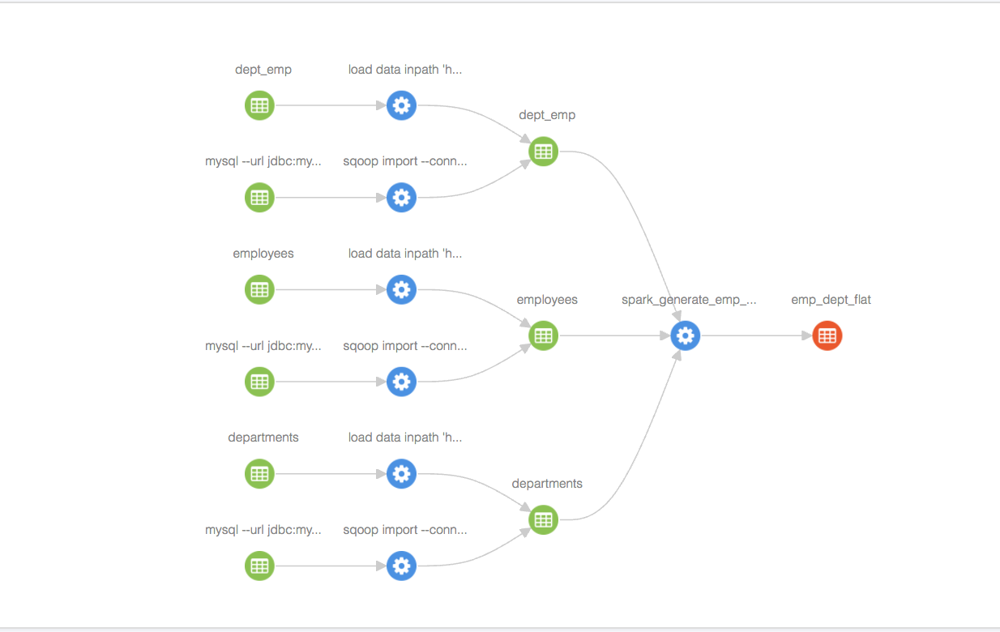

## Setting up atlas lineage with sqoop and spark

### Setup employees mysql db
1. Setup an RDS mysql instance
2. Setup employees db:
```
git clone https://github.com/datacharmer/test_db.git employees_db
cd employees_db
mysql -h <rds_endpoint> -P 3306 -u admin -p < employees.sql
mysql -h <rds_endpoint> -P 3306 -u admin -p -t < test_employees_sha.sql
```    

### Setup employees db in hive
```
hive -e "create database employees"
```

### Sqoop import of mysql tables
These sqoop commands setup the lineage in atlas from mysql to hive:
```
sqoop import --hive-database employees --table employees --connect jdbc:mysql://<rds_endpoint>:3306/employees --username <rds_username> --password <rds_password> --hive-import -m 1
   
sqoop import --hive-database employees --table departments --connect jdbc:mysql://<rds_endpoint>:3306/employees --username <rds_username> --password <rds_password> --hive-import -m 1
   
sqoop import --hive-database employees --table dept_emp --connect jdbc:mysql://<rds_endpoint>:3306/employees --username <rds_username> --password <rds_password> --hive-import -m 1
```     

Note:
If the sqoop jobs fail with 'Argument list too long', its because of the long HADOOP_CLASSPATH set by sqoop. Add the following code to configure-sqoop script in <sqoop_home>/bin, just before the final export commands:
```
HADOOP_CLASSPATH=$(echo "$HADOOP_CLASSPATH" | perl -ne 'chomp; for(split ":") { $s .= ":$_" if $h{$_} ne 1; $h{$_} = 1}; print "$s"')
```

### Spark lineage
1. Run the spark etl job which creates new hive table emp_dept_flat: https://github.com/bernhard-42/Spark-ETL-Atlas/blob/master/spark-etl.scala. Not down the spark job id
2. Import the hive table emp_dept_flat to Atlas: `<atlas_home>/hook-bin/import-hive.sh`
    Note: If the import-hive.sh fails with classnot found errors:
    ```
    a. export ATLASCPPATH=<atlas_home>/server/webapp/atlas/WEB-INF/lib/*
    b. export HADOOP_CLASSPATH=`hadoop classpath`
    ```
3. Create spark lineage
```
a. Download atlas-lineage-0.1.jar from 
b. export HADOOP_CLASSPATH=<atlas_home>/server/webapp/atlas/WEB-INF/lib/*:atlas-lineage-0.1.jar
c. export HADOOP_USER_CLASSPATH_FIRST=true
d. hadoop  jar atlas-lineage-0.1.jar org.apache.atlas.lineage.SparkLineage -a <atlas_endpoint> -c <atlas_cluster_name> -j <spark_job_id> -p <spark_process_name>
```
4. This creates the lineage like below:




 